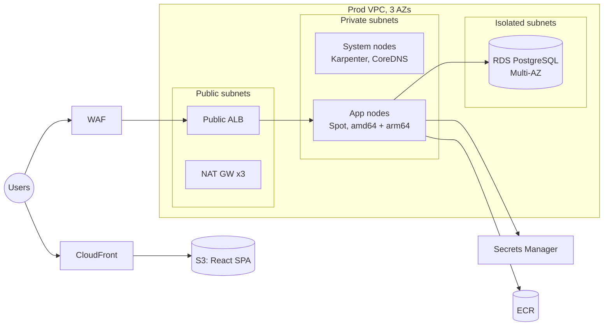
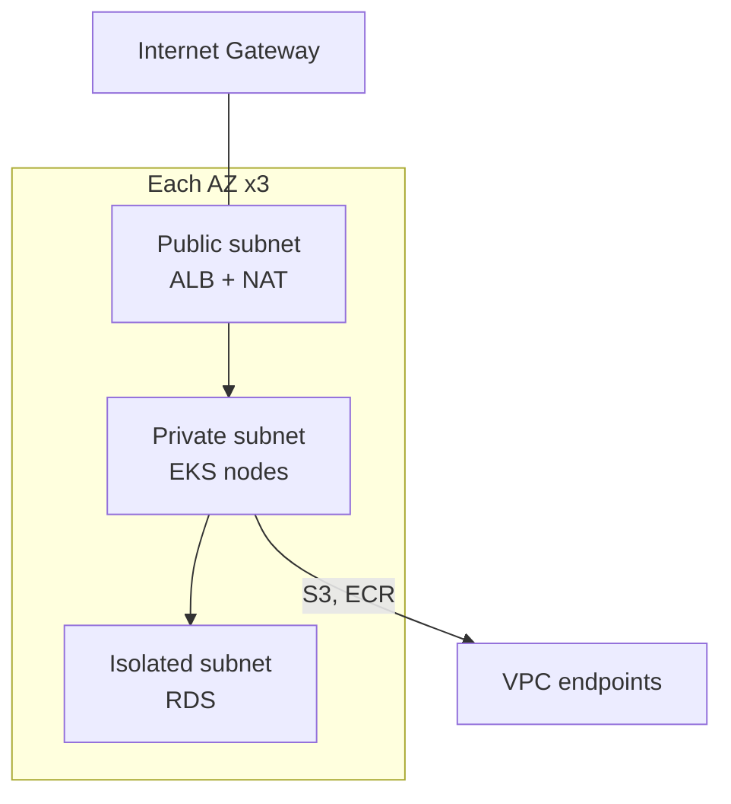
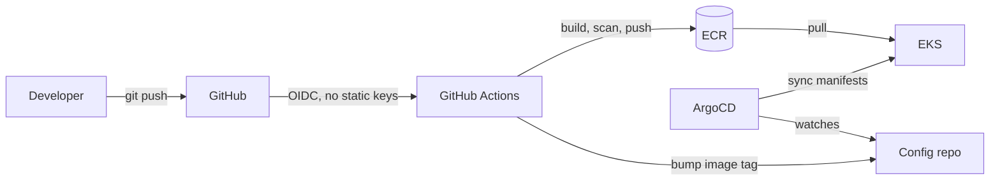

# Innovate Inc. — Cloud Architecture

Design for Innovate Inc.'s web application: a Python/Flask REST API, a React SPA, and a PostgreSQL database. Traffic starts at a few hundred users a day and the plan is to grow to millions. The data is sensitive, and the team wants CI/CD from day one.

Target cloud is **AWS**. It has the managed services this stack needs (EKS, RDS, Secrets Manager, IAM Identity Center) and the compliance coverage (SOC 2, HIPAA, PCI) that the sensitive-data requirement calls for. GCP would also work; equivalents are noted at the end.

The design favors managed services over self-hosting, multi-account isolation over a single shared account, and autoscaling (Karpenter + HPA) over fixed capacity. Nothing here is exotic. It's the layout a team can run without a large platform group.

---

## High-level diagram

Production runtime, single environment shown. Dev and staging are the same shape in their own accounts.

---

## 1. Cloud Environment Structure

One AWS Organization, **six accounts**:

| Account | Purpose |
| --- | --- |
| `management` | Org root, consolidated billing, SCPs. No workloads. |
| `log-archive` | Write-only sink for CloudTrail and VPC flow logs. Locked down for audit. |
| `security-tooling` | GuardDuty, Security Hub, central findings and incident response. |
| `shared-services` | ECR, Route53 hosted zones, CI runners. Shared by every environment. |
| `dev` | Application environment. |
| `staging` | Application environment. |
| `prod` | Application environment. |

Why split this way instead of one account with tags:

- **Isolation.** An account is a hard security and quota boundary. A mistake or a compromise in `dev` can't reach `prod` data. Tag-based separation in a single account leaks the moment one IAM policy is too broad.
- **Billing.** Per-account cost reports need no tag discipline to be correct. "What does prod cost" is one number, not a query you hope was tagged right.
- **Management.** SCPs let the Org enforce guardrails that even account admins can't override (for example, "CloudTrail can't be disabled" or "only approved regions"). Identity Center (SSO) is the single sign-on entry point, so there are no long-lived IAM users sitting in each account.

This is more than a startup at a few hundred users strictly needs on day one, but accounts are free and migrating workloads between them later is painful. Start with the boundary in place.

---

## 2. Network Design

One VPC per environment, in its own account. Each VPC is a `/16` across **three Availability Zones** with three subnet tiers per AZ:

- **Public.** ALBs and NAT gateways. The only tier reachable from the internet.
- **Private.** EKS worker nodes (system and application). Outbound through NAT, no inbound from the internet.
- **Isolated.** RDS. No route to the internet at all, in or out.

Three AZs, not two, because RDS Multi-AZ failover and any future stateful workload (a queue, a cache cluster) need three for quorum to survive losing one AZ. NAT is per-AZ in prod so a single AZ outage doesn't take out egress, and to avoid cross-AZ data charges on NAT traffic. (The Terraform POC uses a single NAT to save money; prod flips that.)

### Securing it

- Security groups chain by tier: the ALB takes 443 from the internet, nodes take traffic only from the ALB SG, RDS takes 5432 only from the node SG. No IP-range rules where a security-group reference does the job.
- WAF on the public ALB for the OWASP rule set (SQLi, XSS, rate limiting).
- VPC endpoints for S3 (gateway) and ECR plus Secrets Manager (interface), so image pulls and secret reads never leave the AWS network or burn NAT data charges.
- RDS sits in the isolated tier with no internet route. It isn't reachable from outside the VPC at all.
- VPC flow logs ship to `log-archive`. GuardDuty watches for anomalies.
- TLS on the ALB and CloudFront via ACM, and on the pod-to-RDS connection.
- The EKS API endpoint is private, with public access restricted to a CIDR allowlist (fully private behind the VPN for prod).

---

## 3. Compute Platform

### Kubernetes (EKS)

Managed EKS. AWS runs the control plane (no etcd to operate), keeps it patched, and integrates with IAM. Pods get AWS permissions two ways, depending on the workload:

- **IRSA** for application pods. Each service account binds to an IAM role through the cluster OIDC provider, so a pod gets exactly the permissions it needs and nothing from the node.
- **Pod Identity** for the Karpenter controller, which is what the EKS Karpenter module sets up by default.

No pod inherits node-level IAM. No static AWS keys live in the cluster.

### Node groups, scaling, resource allocation

Two layers:

1. **A small managed node group** (2-3 on-demand instances, tainted `CriticalAddonsOnly`) that hosts only the system pods: Karpenter itself, CoreDNS, the load balancer controller. Karpenter can't schedule its own controller, so this layer has to exist outside Karpenter's control.
2. **Karpenter for everything else.** Two NodePools, one `amd64` and one `arm64` (Graviton), both running Spot. Karpenter watches for pending pods and provisions the cheapest instance that fits, mixing families and sizes. Consolidation drains underutilized nodes automatically. Workloads that can't tolerate Spot interruption get a third on-demand NodePool.

Scaling is two-dimensional and the layers stack cleanly:

- **HPA** scales pod replicas on CPU/memory (or custom metrics).
- **Karpenter** scales nodes to fit the pods HPA creates.

Every workload sets resource **requests and limits** so the scheduler can bin-pack and so one noisy pod can't starve a node. User-facing deployments get **PodDisruptionBudgets** so consolidation and Spot reclaims can't take down too many replicas at once.

### Containerization: build, registry, deploy

- **Build.** GitHub Actions builds the container on each merge. Images are multi-arch (`docker buildx`, linux/amd64 + linux/arm64) so the same tag runs on x86 or Graviton.
- **Registry.** ECR, with scan-on-push and a lifecycle policy that expires untagged images. Lives in `shared-services`, pulled by every environment.
- **Auth.** Actions authenticates to AWS with OIDC scoped to the repo and branch. No access keys in GitHub secrets.
- **Deploy.** GitOps with ArgoCD. The pipeline bumps an image tag in a config repo; ArgoCD reconciles that against the cluster. Rollback is a git revert, and there's an audit trail of every change. For early stages a plain `kubectl apply` from CI is the simpler fallback, but it loses drift detection.

### Frontend (SPA)

The React build is static, so it doesn't belong in the cluster. It goes to S3 behind CloudFront, with the API on the same domain through the ALB. Cheap, fast, and scales without any work.

---

## 4. Database

**Amazon RDS for PostgreSQL, Multi-AZ.**

Why RDS over the alternatives:

- **Self-managed Postgres on EC2** means patching, backups, failover, and replication are all on the team. No reason to take that on for a standard relational workload.
- **Aurora PostgreSQL** is the better engine at scale (faster failover, storage that auto-grows, low-lag readers). It's also more expensive and the app doesn't need it yet. It's the planned upgrade path, not the starting point.

So: start on RDS Multi-AZ, move to Aurora when a single writer becomes the bottleneck.

**Backups.** Automated daily snapshots plus point-in-time recovery within a 35-day window. A manual snapshot before any risky schema migration.

**High availability.** Multi-AZ keeps a synchronous standby in a second AZ. If the primary fails, RDS fails over to the standby in under a minute behind the same endpoint. The standby isn't readable, so read scaling uses a separate read replica when needed.

**Disaster recovery.** A cross-region read replica that can be promoted if the whole primary region goes down. Rough targets: RPO of a few seconds (async replication lag), RTO around 15 minutes (promotion plus DNS).

**Credentials.** The DB password lives in Secrets Manager with rotation enabled. Pods read it through the External Secrets Operator, which uses an IRSA-bound role to fetch the secret and project it as a Kubernetes Secret. The password is never in an image, a manifest, or git.

---

## Scaling from hundreds to millions

Compute mostly takes care of itself: HPA adds replicas, Karpenter adds nodes, up to the EC2 quota. The database is the real ceiling. The path is vertical scale on RDS first, then read replicas for read-heavy traffic, then Aurora when the single writer is saturated. After that come the usual levers: ElastiCache in front of hot queries, CloudFront for assets (already there for the SPA), and partitioning the database by tenant if the workload calls for it.

## Rough cost

The starting footprint (dev + staging + prod, low traffic) lands around **$700-800/month**, dominated by NAT gateways, RDS, and the Spot fleet. At millions of users it's in the **$15-30k/month** range, at which point cost optimization (Savings Plans, Reserved Instances for RDS, more VPC endpoints to cut NAT data charges) becomes a real workstream.

## GCP equivalents

If the choice were GCP instead: GKE Autopilot or Standard for EKS, Cloud SQL for PostgreSQL (or AlloyDB as the Aurora-equivalent scale path), Artifact Registry for ECR, separate Projects under a Folder hierarchy for the multi-account structure, and Workload Identity for IRSA. The shape of the design doesn't change.
